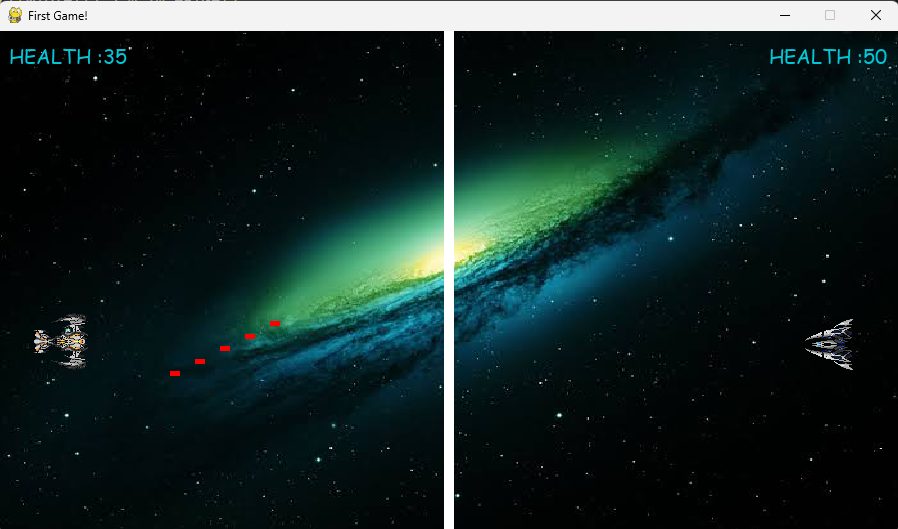
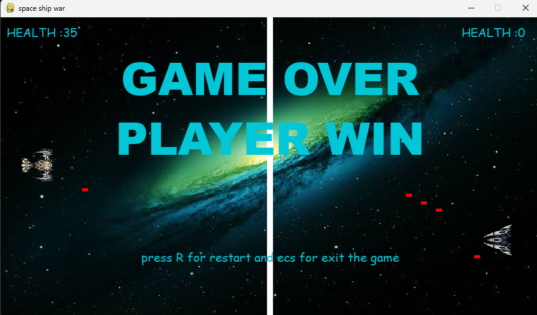

# 🚀 Spaceship Game

A 2D spaceship shooter game built using **Pygame**. One player controls a spaceship while battling an AI-controlled enemy ship. Fire bullets, dodge incoming attacks, and survive as long as possible!

---

## 🎮 Features

- Player-controlled spaceship using keyboard input
- AI-controlled bot spaceship with simple attack behavior
- Health bar and game-over detection
- Restart and exit functionality (`R` to restart, `ESC` to quit)
- Basic collision detection and bullet handling
- Customizable assets (spaceships, bullets, background)

---

## 🕹️ Controls

| Action       | Key          |
|--------------|--------------|
| Move Up      | `W` or Arrow Up |
| Move Down    | `S` or Arrow Down |
| Shoot        | Configurable (e.g., Spacebar or custom key) |
| Restart Game | `R` |
| Quit Game    | `ESC` |

---

## 🧱 Requirements

- Python 3.7+
- Pygame

---

## 🛠️ Installation

1. **Clone the repository:**
   ```bash
   git clone https://github.com/yourusername/spaceship-game.git
   cd spaceship-game


## 📸 Screenshots






## 🧩 Folder Structure
```
  spaceship-game/
  ├── assets/
  │   ├── spaceship.png
  │   ├── background.jpg
  │   └── bullet.png
  ├── main.py
  ├── spaceship.py
  └── README.md
```

## 🔧 Customization
You can modify:
+ Player and bot spaceship images (assets/)

+ Game difficulty (e.g. bot speed, bullet rate)

+ Controls via buttons configuration in code

## 💼 About the Project

  This game was built to practice object-oriented programming in Python using Pygame. It focuses on event handling, class design, and real-time game loops.

## 💡 idea can be implemented

### 🎯 Multiple Levels
  Progress through increasing difficulty with new maps, faster enemies, or limited time challenges.

### 💥 Different Bullet Types & Healing Power-ups
  Unlock bullets with more damage, spread fire, or piercing ability. Add healing packs that restore player health.

### 🧠 Bot AI Strategy Based on Health
  Make the bot smarter:
  
  - When its health is high → aggressive
    
  - When health is low → dodges, retreats, or uses smarter firing patterns
